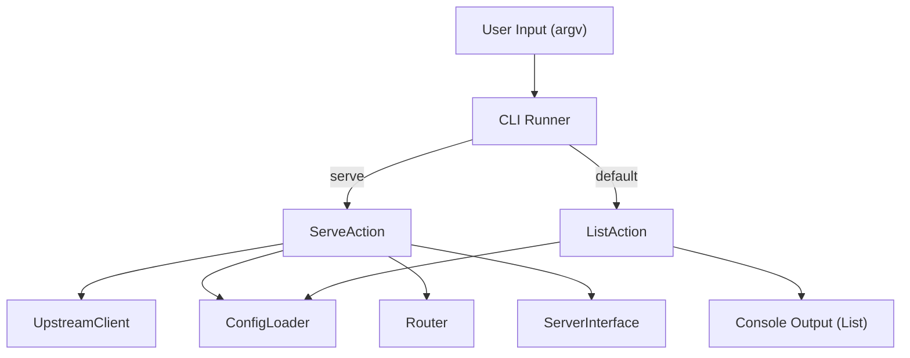

# Technical Design: CLI Refactor

## Overview
CLIの構造をサブコマンド形式にリファクタリングする。`mcpc` を実行するとサーバー一覧を表示し、`mcpc serve` でサーバーを起動する。

## Architecture

### Components

1.  **Entry Point (`src/index.ts`)**
    *   CLIの初期化と実行のエントリーポイント。
    *   `src/cli/runner.ts` (新規) を呼び出す。

2.  **CLI Runner (`src/cli/runner.ts`)**
    *   `commander` を設定し、コマンド定義を行う。
    *   ルートコマンド（デフォルト）として `ListAction` を登録。
    *   サブコマンド `serve` として `ServeAction` を登録。

3.  **Actions**
    *   **ListAction (`src/actions/list.ts`)**: 設定をロードし、サーバーIDとタグの一覧を標準出力（または標準エラー）に表示する。
    *   **ServeAction (`src/actions/serve.ts`)**: 既存の `src/index.ts` にあるサーバー起動ロジックを移動。

### Data Flow

## Detailed Design

### 1. `src/actions/list.ts`
*   **Input**: `tags` (optional filters)
*   **Logic**:
    1.  `ConfigLoader.loadConfigs(tags)` を呼び出す。
    2.  取得した `ServerConfig` 配列をループ。
    3.  `ID: [tag1, tag2]` の形式で出力。
*   **Output**: Console log.

### 2. `src/actions/serve.ts`
*   **Input**: `transport`, `port`, `tags`
*   **Logic**: 既存の `src/index.ts` のロジックを関数化。
    *   `runServe(options)`

### 3. `src/cli/runner.ts`
*   `commander` インスタンスを作成。
*   `.command('serve')` を定義。
*   ルートアクションとして `list` ロジック（または `src/actions/list.ts` の呼び出し）を定義。
*   `program.parseAsync(argv)` を実行。

### Migration Steps
1.  `src/actions/` ディレクトリ作成。
2.  `src/index.ts` のロジックを `src/actions/serve.ts` に移動。
3.  `src/actions/list.ts` を実装。
4.  `src/cli/runner.ts` を実装し、commander設定を行う。
5.  `src/index.ts` を `runner` 呼び出しのみに変更。
6.  `src/cli/args.ts` は不要になるため削除または `runner.ts` に統合。

## Impact
*   既存の `mcpc --transport ...` は `mcpc serve --transport ...` に変わる。
*   互換性を考慮し、ルートコマンドで不明なオプションが渡された場合の挙動（`commander`のデフォルト）を確認するが、今回は明確に仕様変更とする。
