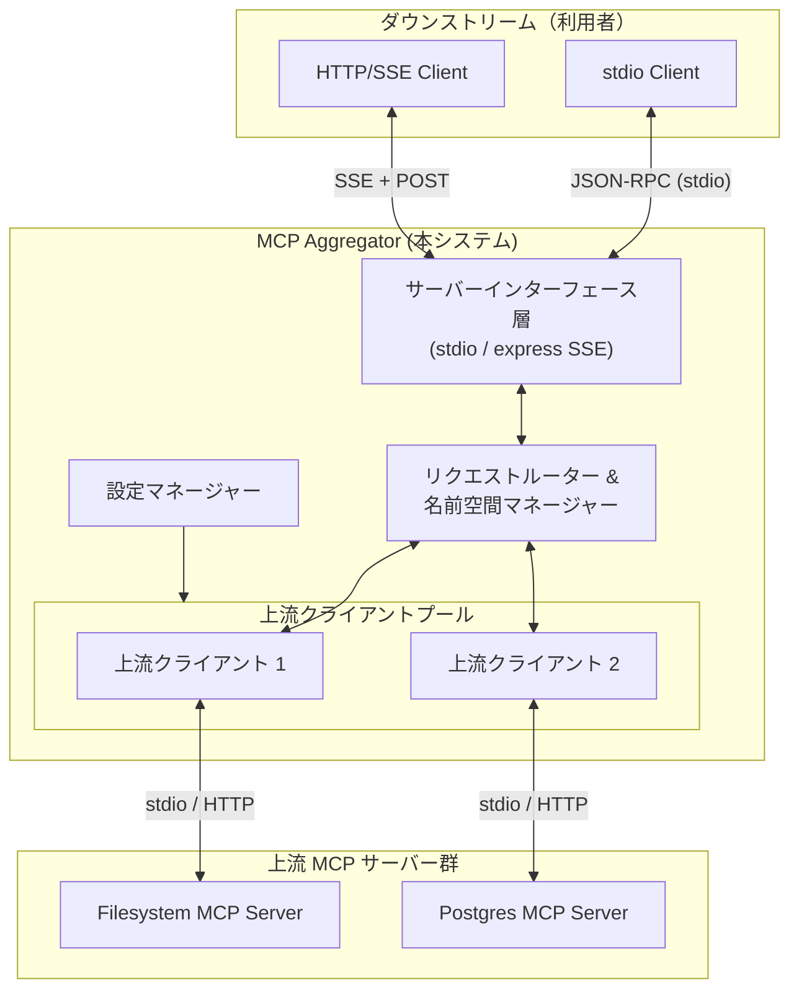
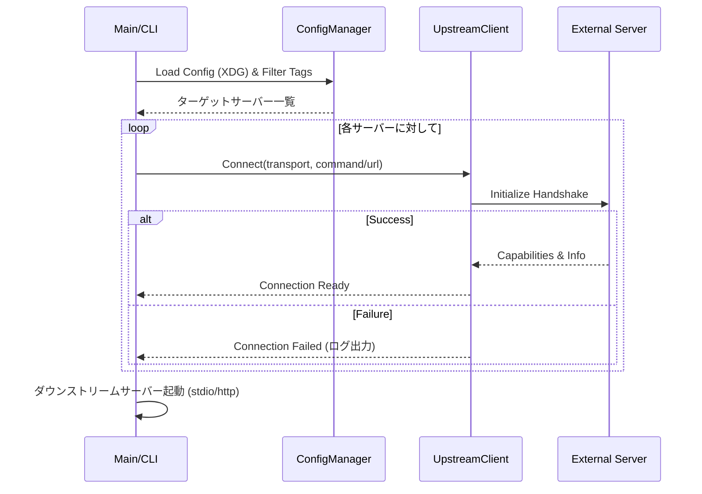
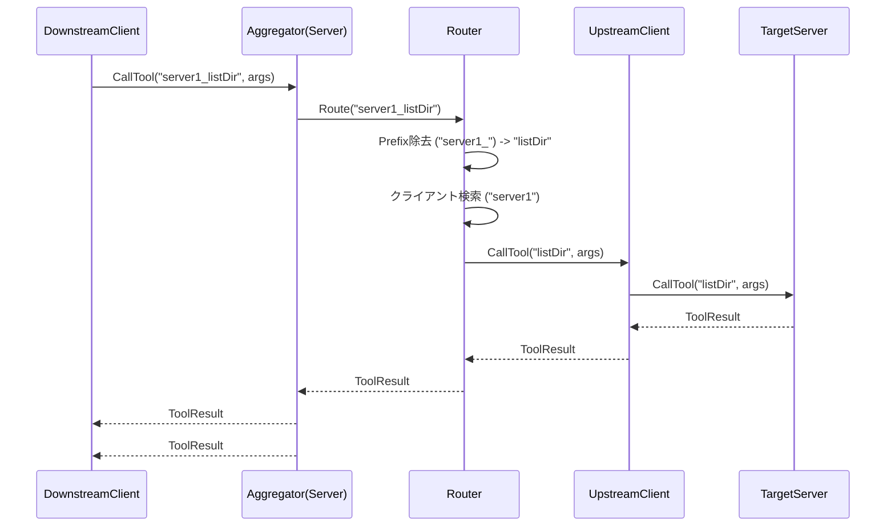

# Technical Design: mcp-aggregator

---
**Purpose**: 実装者間の解釈のブレを防ぎ、一貫性のある実装を保証するための詳細を提供する。
---

## Overview
**Purpose**: 本機能は、Model Context Protocol (MCP) サーバー群のための集約プロキシ（アグリゲーター）として機能する。AIクライアント（AIエージェントやIDEなど）が単一のエンドポイントに接続するだけで、背後にある複数のMCPサーバーが提供するツール、リソース、プロンプトを利用できるようにする。
**Users**: AIクライアント、開発者、システム管理者。
**Impact**: 複数のサーバー接続を一つに集約することでクライアント側の設定を簡素化し、分散した機能への統一的なアクセスを実現する。

### Goals
- 複数の上流MCPサーバーを、単一の下流MCPサーバーとして集約する。
- 下流クライアント向けに、`stdio` と `Streamable HTTP` (SSE) の両方のインターフェースをサポートする。
- XDG準拠のJSONファイルによる堅牢な設定管理を提供する。
- サーバー固有のプレフィックスを使用した名前空間の分離を実装する。

### Non-Goals
- 複雑な認証・認可ロジックの実装（v1では信頼された環境を想定）。
- プロトコル変換（例: 非MCP APIのMCPへの変換）。

## Architecture

### Architecture Pattern & Boundary Map



**Architecture Integration**:
- **Pattern**: Proxy / Aggregator パターン。
- **Boundaries**: アグリゲーターは、複数の上流接続を管理する複雑さからダウンストリームクライアントを分離する。双方向のプロトコル終端点として機能する。
- **New Components**: `ServerInterface` (下流向け), `Router` (ロジック), `UpstreamClient` (上流接続)。

### Technology Stack

| Layer | Choice / Version | Role in Feature | Notes |
|-------|------------------|-----------------|-------|
| Runtime | Node.js v24 (ESM) | JS Runtime | 最新のLTS環境 |
| Language | TypeScript | Type Safety | 高度な抽象化と型安全性 |
| Protocol | `@modelcontextprotocol/sdk` | MCP Implementation | 公式SDK (Client & Server) |
| HTTP Server | `hono` | Streamable HTTP | 軽量・高速なWebフレームワーク |
| Server Adapter | `@hono/node-server` | Node Compatibility | Node.jsでHonoを動作させるアダプタ |
| CLI | `commander` | CLI Parsing | 引数解析 |
| Configuration | `zod` | Validation & Typing | 設定ファイルのバリデーション |

## System Flows

### 1. 初期化・接続フロー



### 2. リクエストルーティング (例: CallTool)



## Requirements Traceability

| Requirement | Summary | Components | Interfaces | Flows |
|-------------|---------|------------|------------|-------|
| 1.1, 1.2 | Client Transport (stdio/http) | UpstreamClient, sdk | UpstreamConnection | Init Flow |
| 1.3, 1.4 | Connection Mgmt & ID | ConfigManager, UpstreamClient | ClientPool | Init Flow |
| 2.1, 2.2 | Server Interface (stdio/sse) | ServerInterface, sdk, hono | DownstreamServer | - |
| 2.3 | Aggregation (List) | Router | AggregationLogic | - |
| 2.4 | Namespace Prefixing | Router | NameMapper | Routing Flow |
| 2.5, 2.6 | Routing & Relay | Router | RequestRouter | Routing Flow |
| 3.1, 3.2 | Config Loading (XDG) | ConfigManager | ConfigParser | Init Flow |
| 3.3, 3.4 | Tag Filtering | ConfigManager | TagFilter | Init Flow |

## Components and Interfaces

### Summary
| Component | Domain/Layer | Intent | Req Coverage | Key Dependencies | Contracts |
|-----------|--------------|--------|--------------|------------------|-----------|
| `ConfigManager` | Core/Config | 設定のロードとフィルタリング | 3.1-3.5, 1.1 | `zod`, `dirs` | Service |
| `UpstreamClient` | Core/Client | 単一の上流接続管理 | 1.1-1.4 | `@modelcontextprotocol/sdk` | Service |
| `Router` | Core/Logic | リクエストルーティングと集約 | 2.3-2.6 | `UpstreamClient` | Service |
| `ServerInterface`| Interface | 下流へのアグリゲーター機能公開 | 2.1, 2.2 | `sdk`, `hono`, `Router` | Service |

### Core / Configuration

#### `ConfigManager`

| Field | Detail |
|-------|--------|
| Intent | JSON設定をロードし、タグフィルタを適用し、サーバー定義を返す。 |
| Requirements | 3.1, 3.2, 3.3, 3.4, 3.5 |

**Responsibilities**
- `XDG_CONFIG_HOME/mcpc/*.json` をスキャンする。
- `mcpServers` と `tags` をパースする。
- CLI引数に基づいてサーバーをフィルタリングする。

##### Service Interface
```typescript
interface ServerConfig {
    id: string;
    command: string;
    args: string[];
    env?: Record<string, string>;
    tags: string[];
}

class ConfigManager {
    static async loadConfigs(tagFilter?: string[]): Promise<ServerConfig[]>;
}
```

### Core / Client

#### `UpstreamClient`

| Field | Detail |
|-------|--------|
| Intent | MCPクライアントセッションをラップし、接続ライフサイクルを管理する。 |
| Requirements | 1.1, 1.2, 1.3, 1.4 |

**Responsibilities**
- stdio または SSE 経由で接続する。
- 接続状態を維持する。
- 上流のツール/リソースを呼び出すメソッドを公開する。

##### Service Interface
```typescript
class UpstreamClient {
    readonly id: string;
    constructor(config: ServerConfig);
    async connect(): Promise<void>;
    async listTools(): Promise<Tool[]>;
    async callTool(name: string, args: any): Promise<CallToolResult>;
}
```

### Core / Logic

#### `Router`

| Field | Detail |
|-------|--------|
| Intent | 機能を集約し、実行リクエストをルーティングする。 |
| Requirements | 2.3, 2.4, 2.5, 2.6 |

**Responsibilities**
- `UpstreamClient` のレジストリを保持する。
- `ListTools` のレスポンスをマージし、プレフィックスを付与する (例: `{server_id}_{tool_name}`)。
- `CallTool` のツール名を解析してターゲットサーバーを特定する。
- リクエストを転送し、レスポンスを返す。

##### Service Interface
```typescript
class Router {
    constructor(clients: UpstreamClient[]);
    async getAllTools(): Promise<Tool[]>;
    async dispatchCallTool(name: string, args: any): Promise<CallToolResult>;
}
```

### Interface Layer

#### `ServerInterface`

| Field | Detail |
|-------|--------|
| Intent | Routerの機能をMCPプロトコル経由で公開する。 |
| Requirements | 2.1, 2.2 |

**Responsibilities**
- `McpServer` クラスを使用する。
- SSEモード用の `hono` サーバーを起動し、`@hono/node-server` でサーブする。
- stdioモード用の標準入出力トランスポートを使用する。
- 受信したMCPリクエストを `Router` 呼び出しに変換する。

**Implementation Notes**
- **Stdio Mode**: `StdioServerTransport` を使用。
- **SSE Mode**: `SSEServerTransport` を `hono` のストリームレスポンスにアダプトする。
  - `GET /sse`: `streamSSE` ヘルパーなどを使用。
  - `POST /messages`: JSONボディを受け取り `transport.handlePostMessage` に渡す。

## Data Models

### Logical Data Model
- **Config Schema (Zod)**:
  ```typescript
  const ConfigSchema = z.object({
    tags: z.array(z.string()),
    mcpServers: z.record(z.object({
      command: z.string(),
      args: z.array(z.string()),
      env: z.record(z.string()).optional()
    }))
  });
  ```

## Error Handling

### Error Strategy
- **Partial Failure**: 上流サーバーの一部が失敗しても、システム全体は継続。
- **Routing Error**: 不明なプレフィックスには標準のMCPエラーコードを返す。

## Testing Strategy
- Vitestなどを用いたユニットテストと、Mockサーバーを用いた結合テスト。
